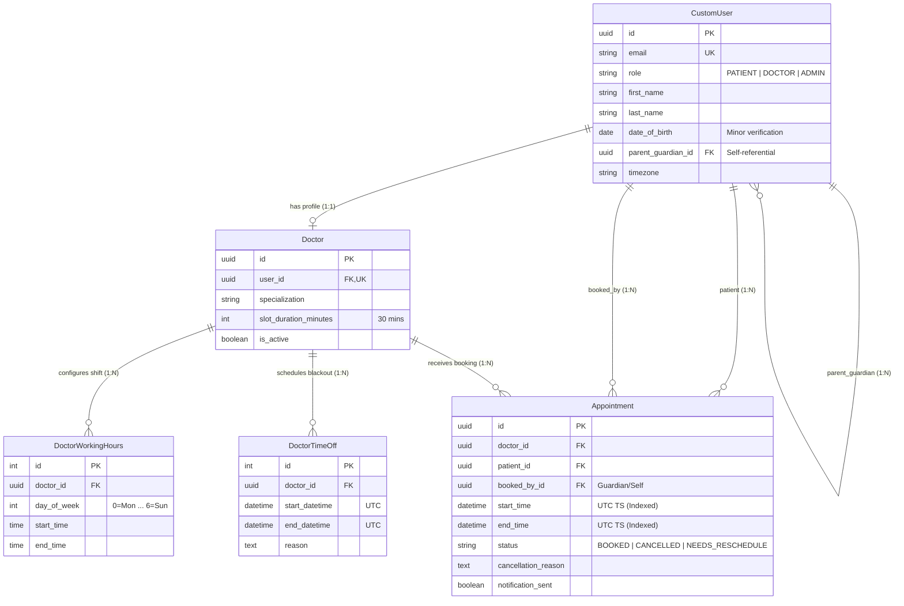

# AppointmentGuard — System Design & Architecture

> **AppointmentGuard** is a robust, concurrent, and scalable clinic appointment booking system built with Django, Django REST Framework (DRF), and PostgreSQL, paired with a modern Next.js front-end dashboard.

---

## Table of Contents
1. [System Design Overview](#1-system-design-overview)
2. [Domain Models & Data Architecture](#2-domain-models--data-architecture)
3. [System Components & High-Level Architecture](#3-system-components--high-level-architecture)
4. [Key Engineering Decisions & Trade-Offs](#4-key-engineering-decisions--trade-offs)
   - [Decision 1: Dynamic Slot Generation vs. Stored Slot Records](#decision-1-dynamic-slot-generation-vs-stored-slot-records)
   - [Decision 2: Universal Timezone Standard (UTC)](#decision-2-universal-timezone-standard-utc)
   - [Decision 3: Race Condition Prevention (`select_for_update` vs. Unique Constraints)](#decision-3-race-condition-prevention-select_for_update-vs-unique-constraints)
   - [Decision 4: Doctor Working Hours & Time-Off Overrides](#decision-4-doctor-working-hours--time-off-overrides)
   - [Decision 5: Doctor Blackout Conflict Resolution (Patterns B & C)](#decision-5-doctor-blackout-conflict-resolution-patterns-b--c)
   - [Decision 6: Family Dependent Booking (Under-18 Minor Rule)](#decision-6-family-dependent-booking-under-18-minor-rule)
   - [Decision 7: Doctor-Initiated Cancellation & Patient Notification Dispatch](#decision-7-doctor-initiated-cancellation--patient-notification-dispatch)
   - [Decision 8: Working Hours Shift Alterations & Conflict Auditing](#decision-8-working-hours-shift-alterations--conflict-auditing)
   - [Decision 9: Full-Day Doctor Cancellation & Bulk Conflict Resolution](#decision-9-full-day-doctor-cancellation--bulk-conflict-resolution)
   - [Decision 10: Atomic Rescheduling & Rollback Protection](#decision-10-atomic-rescheduling--rollback-protection)
5. [Enforced Business Rules & Constraints](#5-enforced-business-rules--constraints)
6. [API Architecture & Endpoints](#6-api-architecture--endpoints)
7. [Deployment & Containerization Architecture](#7-deployment--containerization-architecture)
8. [How to Run Locally (Local Setup Guide)](#8-how-to-run-locally-local-setup-guide)

---

## 1. System Design Overview

AppointmentGuard provides a multi-doctor clinic booking platform (starting with 5 doctors and designed to scale to thousands of doctors and patients). The system enforces strict scheduling integrity, preventing double bookings, respecting working hours and doctor time-offs, supporting dependent minor bookings, and providing atomic rescheduling with zero-loss rollback protection.

---

## 2. Domain Models & Data Architecture



### Domain Entity & Field Specifications

* **`CustomUser` (User Identity & Role Access)**:
  * `id` (`UUID`): Primary key.
  * `email` (`String`): Unique account identifier.
  * `role` (`Enum`): Access level (`PATIENT`, `DOCTOR`, `ADMIN`).
  * `date_of_birth` (`Date`): Evaluated by `is_minor()` to check under-18 dependent status.
  * `parent_guardian` (`FK`): Self-referential link pointing to parent/guardian user account for minor dependents.
  * `timezone` (`String`): Preferred timezone identifier (e.g. `'Africa/Nairobi'`, `'UTC'`).

* **`Doctor` (Doctor Profile)**:
  * `id` (`UUID`): Primary key.
  * `user` (`OneToOne`): Linked 1-to-1 with `CustomUser`.
  * `specialization` (`String`): Expertise area (e.g. *General Practice*, *Pediatrics*).
  * `slot_duration_minutes` (`Int`): Fixed 30-minute grid interval duration.
  * `is_active` (`Boolean`): Active doctor filter flag.

* **`DoctorWorkingHours` (Weekly Shift Templates)**:
  * `doctor` (`FK`): Linked doctor.
  * `day_of_week` (`Int`): Operating day (`0=Monday` to `6=Sunday`).
  * `start_time` & `end_time` (`Time`): Shift window bounds.

* **`DoctorTimeOff` (Blackout Overrides)**:
  * `doctor` (`FK`): Linked doctor.
  * `start_datetime` & `end_datetime` (`Aware UTC Datetime`): One-off blackout range.
  * `reason` (`Text`): Emergency or vacation leave reason.

* **`Appointment` (Booking Records)**:
  * `id` (`UUID`): Primary key.
  * `doctor` (`FK`): Assigned doctor.
  * `patient` (`FK`): Recipient user receiving medical care.
  * `booked_by` (`FK`): User who initiated the booking (Patient or Parent/Guardian).
  * `start_time` & `end_time` (`UTC Timestamp`): 30-minute slot boundaries.
  * `status` (`Enum`): Lifecycle state (`BOOKED`, `CANCELLED`, `NEEDS_RESCHEDULE`).
  * `cancellation_reason` (`Text`): Stored reason for cancellation or shift displacement.
  * `notification_sent` (`Boolean`): Flag indicating dispatch of patient notifications.

> **Database Constraint**: `UniqueConstraint(fields=['doctor', 'start_time'], condition=Q(status='BOOKED'))` guarantees slot uniqueness per doctor at the database schema level.


---

## 3. System Components & High-Level Architecture

AppointmentGuard uses a decoupled layered architecture separating domain entities, data access, business services, REST APIs, and presentation UI:

```
[ Frontend: Next.js App Router (React + TS + CSS Glassmorphism) ]
                              |  HTTP / REST API
                              v
   [ API Layer: DRF API Views & Serializers (appointments/views/api.py) ]
                              |
                              v
 [ Service Layer: Business Logic & Rules (appointments/services/*.py) ]
   ├── booking.py       ── Handles pessimistic row-locking & booking validations
   ├── appointments.py  ── Handles atomic rescheduling & cancellations
   ├── availability.py  ── Handles Doctor Time-Off blackouts & shift audits
   └── slots.py         ── Handles dynamic 30-min grid slot calculation
                              |
                              v
   [ Data Layer: Django ORM + PostgreSQL / SQLite (appointments/models/*.py) ]
```

---

## 4. Key Engineering Decisions & Trade-Offs

### Decision 1: Dynamic Slot Generation vs. Stored Slot Records

* **The Problem**: Pre-generating and storing thousands of empty 30-minute slot rows for months in advance creates massive database bloat and requires complex batch update scripts whenever working hours change.
* **Selected Architecture**: Slots are computed dynamically on demand by `calculate_30_min_slots`. The algorithm generates 30-minute grid intervals bounded by the doctor's `DoctorWorkingHours` for that day, filtering out past times, existing `BOOKED` appointments, and active `DoctorTimeOff` blackout ranges.

### Decision 2: Universal Timezone Standard (UTC)

* **The Problem**: Clinics operating across different regional timezones (e.g. `Africa/Nairobi`, `UTC`) risk schedule misalignment and Daylight Saving Time shift bugs.
* **Selected Architecture**: All appointment timestamps (`start_time`, `end_time`, time-offs) are strictly stored and manipulated as aware UTC datetimes in PostgreSQL. Conversion to local user timezones occurs strictly at the presentation layer.

### Decision 3: Race Condition Prevention (`select_for_update` vs. Unique Constraints)

* **The Problem**: Simultaneous booking requests for the exact same doctor slot can lead to double bookings under high concurrency.
* **Selected Architecture**: A robust two-tiered concurrency safeguard:
  1. **Pessimistic Row Locking**: `Doctor.objects.select_for_update()` locks the target doctor record within an `@transaction.atomic` block during booking and rescheduling.
  2. **Database Constraint**: Hard partial unique constraint `UniqueConstraint(fields=['doctor', 'start_time'], condition=Q(status='BOOKED'))` at the database schema level.

### Decision 4: Doctor Working Hours & Time-Off Overrides

* **The Problem**: Balancing fixed weekly shift patterns with sporadic vacations, emergency leaves, or shift changes.
* **Selected Architecture**: Weekly shifts are modeled in `DoctorWorkingHours` (0=Monday to 6=Sunday). One-off blackout windows are modeled in `DoctorTimeOff`. Time-off ranges act as absolute override filters during dynamic slot calculation and booking validation.

### Decision 5: Doctor Blackout Conflict Resolution (Patterns B & C)

* **The Problem**: When a doctor creates an emergency blackout window that overlaps pre-existing patient bookings, what happens to those bookings?
* **Selected Architecture**: `create_doctor_time_off` automatically scans for overlapping active bookings, updates their status to `NEEDS_RESCHEDULE`, flags `notification_sent = True`, and attaches a custom emergency reason. Affected bookings are preserved for priority rescheduling.

### Decision 6: Family Dependent Booking (Under-18 Minor Rule)

* **The Problem**: Parents or guardians must be able to schedule appointments for minor children without granting children independent account ownership.
* **Selected Architecture**: The `CustomUser` model includes `date_of_birth` and a self-referential `parent_guardian` foreign key. The `is_minor()` method determines if the patient is under 18. Booking logic validates that non-self bookings are strictly performed by verified parents/guardians for minor dependents.

### Decision 7: Doctor-Initiated Cancellation & Patient Notification Dispatch

* **The Problem**: Distinguishing patient-initiated cancellations from doctor-initiated cancellations, ensuring patients are alerted when a doctor cancels.
* **Selected Architecture**: `cancel_appointment` requires a non-empty cancellation reason. If cancelled by a doctor or admin, `notification_sent` is set to `True` to trigger immediate notification alerts to the patient.

### Decision 8: Working Hours Shift Alterations & Conflict Auditing

* **The Problem**: Changing a doctor's shift schedule (e.g., closing early on Wednesdays) could leave pre-existing bookings outside valid working hours.
* **Selected Architecture**: `audit_working_hours_shift_change` audits future bookings whenever shift bounds are altered. Any booking falling outside the new shift bounds is automatically flagged as `NEEDS_RESCHEDULE`.

### Decision 9: Full-Day Doctor Cancellation & Bulk Conflict Resolution

* **The Problem**: Full-day doctor absences require bulk conflict resolution for all scheduled patients on that day.
* **Selected Architecture**: Full-day blackouts trigger an automated bulk transaction that transitions all active bookings on that date to `NEEDS_RESCHEDULE`, attaching priority reschedule notices to each affected patient record.

### Decision 10: Atomic Rescheduling & Rollback Protection

* **The Problem**: If a patient reschedules to a new slot, but the new slot is claimed by another user mid-request, does the patient risk losing their original slot?
* **Selected Architecture**:
  1. **Indivisible State Swap**: `reschedule_appointment` is wrapped in `@transaction.atomic` with pessimistic row locking (`SELECT ... FOR UPDATE`).
  2. **Rollback Guarantee**: If the new slot fails validation (e.g. taken by another patient), a `ValidationError` triggers an automatic database `ROLLBACK`. The original slot remains 100% intact under the patient's name with zero risk of slot forfeiture or data corruption.

---

## 5. Enforced Business Rules & Constraints

1. **Doctor Activity**: Appointments can only be booked with active doctors (`is_active = True`).
2. **Working Hours Alignment**: Every slot must fall strictly within the doctor's configured `DoctorWorkingHours` for that day of the week.
3. **Exact 30-Minute Duration**: All appointments must be exactly 30 minutes long and aligned to 30-minute grid boundaries.
4. **Advance Notice Guarantee**: Appointments cannot be booked in the past and **must be booked at least 1 hour in advance** of current system time (`start_time >= now + 1 hour`).
5. **No Overlapping Bookings**: A slot cannot overlap with any active `BOOKED` appointment for that doctor.
6. **Time-Off Respect**: Slots overlapping with a `DoctorTimeOff` blackout window cannot be booked.
7. **Minor Dependent Booking Rule**: Parents/guardians can book appointments on behalf of dependents under 18 years old.
8. **Doctor Shift & Full-Day Cancellation Audit**: When working hours change or full-day blackouts occur, conflicting pre-existing bookings are automatically flagged for priority rescheduling (`NEEDS_RESCHEDULE`).
9. **Atomic Reschedule & Rollback**: Rescheduling swaps slots atomically. New slot conflicts trigger an automatic transaction rollback, protecting original bookings against accidental forfeiture.

---

## 6. API Architecture & Endpoints

| Method | Endpoint | Description | Access |
| :--- | :--- | :--- | :--- |
| `POST` | `/api/auth/login/` | Authenticates users (Patient, Doctor, Admin) | Public |
| `POST` | `/api/auth/register/` | Registers new clinic users (Patients/Doctors/Admins) | Public |
| `GET` | `/api/doctors/` | Lists all active doctors and specializations | Public |
| `GET` | `/api/doctors/<id>/slots/?date=YYYY-MM-DD` | Computes available 30-min slots for a doctor | Public |
| `GET` | `/api/appointments/` | Returns role-filtered appointments | Authenticated |
| `POST` | `/api/appointments/` | Books a 30-minute appointment slot | Authenticated |
| `POST` | `/api/appointments/<id>/cancel/` | Cancels an appointment with required reason | Authenticated / Owner |
| `POST` | `/api/appointments/<id>/reschedule/` | Atomically swaps an appointment to a new slot | Authenticated / Owner |
| `GET` | `/api/admin/patients/` | Directory of registered patients with search (`?search=`) | Admin Only |
| `POST` | `/api/doctor/time-off/` | Schedules blackout window and flags conflicts | Doctor / Admin |

---

## 7. Deployment & Containerization Architecture

* **Containerization**: Multi-stage `Dockerfile` running Django via Gunicorn with static asset collection.
* **Orchestration**: `docker-compose.yml` linking the web container to a PostgreSQL 15 database service.
* **CI/CD Pipelines**:
  * `.github/workflows/ci.yml`: Automated linting and test execution on `develop` branch pushes and pull requests.
  * `.github/workflows/cd.yml`: Continuous deployment workflow restricted strictly to the `production` branch.
* **Cloud Infrastructure Blueprint**: Configured `render.yaml` for one-click deployment on Render with managed PostgreSQL.

---

## 8. How to Run Locally (Local Setup Guide)

### Option A: Standard Manual Setup (Backend + Frontend)

#### 1. Prerequisites
* Python 3.8+ & `pip`
* Node.js 18+ & `npm`
* PostgreSQL (Optional; defaults to SQLite for local development)

#### 2. Backend Setup (Django REST Framework API)

```bash
# 1. Clone the repository & navigate to directory
git clone https://github.com/Mercy-line/AppointmentGuard.git
cd AppointmentGuard

# 2. Create & activate Python virtual environment
python3 -m venv venv
source venv/bin/activate

# 3. Install backend dependencies
pip install -r requirements.txt

# 4. Run database migrations
python manage.py migrate

# 5. Seed default clinic doctors & working hours
python manage.py seed_clinic_data

# 6. Run Pytest suite to verify installation
pytest

# 7. Start the backend Django development server (Port 8000)
python manage.py runserver 0.0.0.0:8000
```

#### 3. Frontend Setup (Next.js Dashboard)

Open a second terminal window:

```bash
# 1. Navigate to the frontend directory
cd frontend

# 2. Install Node.js dependencies
npm install

# 3. Start the Next.js development server (Port 3000)
npm run dev
```

* **Frontend Dashboard URL**: `http://localhost:3000`
* **Backend REST API URL**: `http://localhost:8000/api/doctors/`

---

### Option B: Docker & Docker Compose (One-Command Setup)

To run the full production container stack (Django API, Next.js UI, PostgreSQL database) with a single command:

```bash
# Build and launch all container services
docker-compose up --build
```

* **Frontend UI**: `http://localhost:3000`
* **Backend API**: `http://localhost:8000`

---

### Demo Accounts for Local Testing

| Role | Email / Username | Password | Access / Capabilities |
| :--- | :--- | :--- | :--- |
| **Patient** | `john@patient.com` | `PatientPass123!` | Book 30-min slots, view scheduled/cancelled visits |
| **Doctor** | `dr.alice@clinic.com` | `DoctorPass123!` | View active patient queue, schedule emergency time-offs |
| **Admin** | `admin@appointmentguard.com` | `AdminPass123!` | View metrics, search patient registry, manage users |

